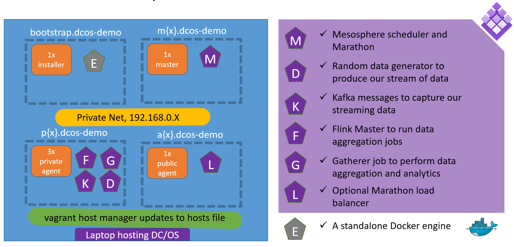

# Introduction

This is a data pipeline demo project for learning how to work with components such as [Kafka](http://kafka.apache.org/), [Flink](http://flink.apache.org/) and [Marathon apps](https://dcos.io/docs/1.9/deploying-services/install/) on [DC/OS](https://dcos.io/) to analyze data.  We will setup the following demo environment:



This is a simple demo for learning DC/OS custom installation and setup on local laptop.

You can also find other cool vagrant and DC/OS demos here:
- https://github.com/dcos/dcos-vagrant.git
- https://github.com/dcos/demos

## Requirements

1. You'll need [vagrant (recommend 1.9.4)](https://www.vagrantup.com/).
2. Install [docker-machine to build the demo app](https://github.com/docker/machine/releases/tag/v0.11.0).  We'll be using the virtualbox driver to get a local docker client.
3. You'll need a current docker client:  https://github.com/moby/moby/releases/tag/v1.13.1
3. A system with about ~16G of RAM, and 8 Cores.  This demo was built on macOS 10.12.3.  SSD drive is highly desirable.  An internet connection with 10 mBits / sec or better.

## Time Estimate

- Allow 60 minutes for vagrant up to complete.
- Allow 30 minutes for DC/OS deployment steps.

## How to prepare

1. (optional) trying to go passwordless?  Visit [these instructions](https://github.com/devopsgroup-io/vagrant-hostmanager#passwordless-sudo) or run these steps:
   ```
   curl -o /tmp/passwordless.sh \
        --url 'https://raw.githubusercontent.com/dcos/dcos-vagrant/master/ci/passwordless.sh' && \
        sudo bash /tmp/passwordless.sh ; \
        rm -f /tmp/passwordless
   ```
1. generate some keys if you haven't done that yet, we'll need those in the keys directory:
   ```
   cd keys && ./genkeys.sh && cd ..
   ```
   NOTE: These keys can not be encrypted, as the DC/OS installation will be using them for an unattended installation.
1. run vagrant up!  `vagrant up` in the root directory of this project.
1. At this point, you might want to take snap shots of all VMs so that you can repeat the DC/OS deployment iteratively with different configurations.

## What does this project do?

- This project will setup 6 nodes for learning how to deploy DC/OS. 1 bootstrap, 1 master, 1 public agent and 3 private agents. Further we will deploy a sample data pipeline.

The goals are simple.  Learn how to [deploy DC/OS](https://dcos.io/docs/1.9/installing/custom/) and manage a simple data pipeline.

- We install docker only on the bootstrap node.
- We configure an ssh key in the keys folder to allow for an ssh based deployment.
- We install minimal packages on all nodes.
- We generate the basic configuration file from the [genconf/config.yaml](genconf/config.yaml)
- Finally we provide a data pipeline [demo](demo/README.md).

## How to use

This is a manual install so we only prepared the minimum setup so that you can experience the steps for master and agents.

1. Connect to the bootstrap node: `vagrant ssh bootstrap.dcos-demo`
2. Change to dcos_install folder : `cd /opt/dcos_install`
3. Install all the node pre-reqs:  `sudo bash ./dcos_generate_config.sh --install-prereqs -v`
4. Verify we can install with pre-flights: `sudo bash ./dcos_generate_config.sh --preflight -v`
4. Deploy DC/OS: `sudo bash ./dcos_generate_config.sh --deploy -v`
5. Verify install is good with post-flights: `sudo bash dcos_generate_config.sh --postflight -v`
6. Setup the [dcos client](docs/dcoscli.md).

Once all these steps are complete, try accessing the DC/OS environment with a local browser at the following URL: ***[http://m1.dcos-demo](http://m1.dcos-demo)***

Tweak the Vagrantfile and genconf/config.yaml for other configurations.  For example, 3 masters, 1 agent, 1 public agent.

## Trouble shoot

We can start with [this site](https://dcos.io/docs/1.9/installing/troubleshooting/), however lets provide some [specific help with the vagrant VMs](docs/TROUBLESHOOTING.md).

## A real demo
Now lets do a [real demo](demo/README.md)!
