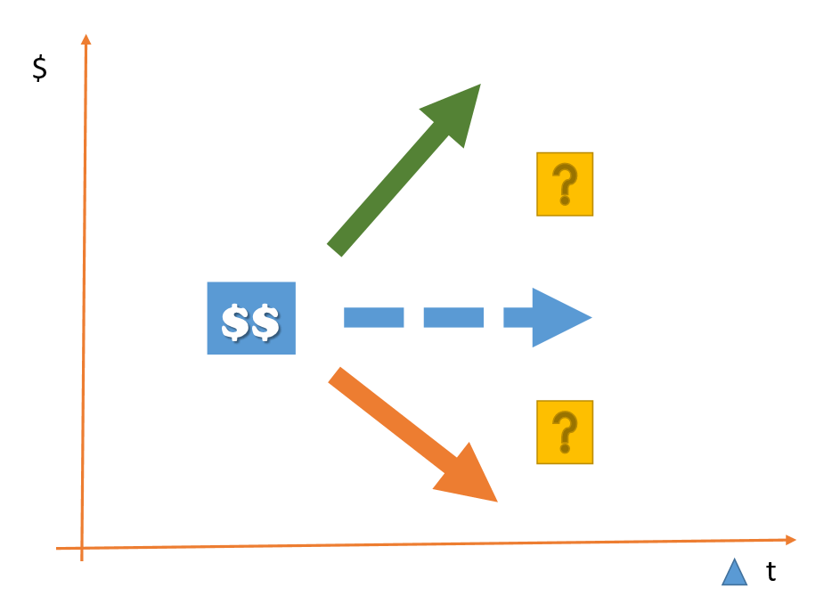

# Introduction

DC/OS as you can see is very easy to deploy, and can be deployed on [many cloud platforms](https://dcos.io/install/).

Our next exercise is to try a real demo.  DC/OS provides it's customers with best in class data analytics platform, and
this is definitely one of the Mesosphere Inc. strengths for data scientist.  This demo will focus on exercising a hypothetical data flow.

# Overview

We will work a simple data pipeline that allows us to solve a basic question.
The pipeline will best be represented by a 3 step flow.

```text
|------------------|     |---------------------|     |-------------------|
| A data generator | --> | A message queue     | --> | A consumer to     |
| to produce data  |     | to capture the data |     | analyze the data  |
|------------------|     |---------------------|     |-------------------|
```

These are the components that we will work with:
1. A simple go app in a container to generate and produce the data.
2. Kafka topics to capture the data in a message queue for later processing.
3. Flink analytics script to consume the message queue data and provide some
   real time analysis of the data to help us capture an answer to our problem.

# Requirements & Component Install

The components that need to be setup ahead of time include:
1. A minimal install of [Kafka](https://github.com/dcos/examples/tree/master/kafka/1.9) to capture the data.
2. A docker engine so that we can [build and create the container image](data_generator/README.md).
3. A minimal install of [Flink](https://github.com/dcos/examples/tree/master/flink/1.9) to analyze the data.

# This projects layout

+- [**demo**](README.md) - this folder
- +-- [**kafka_topic**](kafka_topic) - a folder to setup our kafka topic for the message queue.
- +-- [**data_generator**](data_generator/README.md) - a folder with a simple [Dockerfile](data_generator/Dockerfile) to represent our data generator.
- +-- [**flink_scripts**](flink_scripts) - a folder to help us analyze the incoming data
- +-- [**gatherer**](gatherer) - a maven project that helps us aggregate the data_generator topics.

# Setup

To setup the demo, follow each README.md in the projects folders. First setup
[**Kafka**](kafka_topic), then [**Flink**](flink_scripts), and finally the [**data generator**](data_generator/README.md).

Make sure to implement each component fully before moving on to the next.

# Using DC/OS, kafka and flink to determine volatility

Financial statistics often help us make decisions on how we invest our money. Financial
institutions use complex data analytics to make daily decisions on financial positions.
We will use some simple standard deviation to show how we can use flink to aggregate
price data over time and get a sense for volatility in a given set of data.



** Can we determine moving volatility over time for a given set of positions to make buy or sell decisions? **

Lets use the data generator topics as a way to provide us with the current price of
some factitious position. The data will provide a continuous stream of random prices
that can be used to perform aggregation and data analysis.

Now lets use the [**gatherer**](gatherer) project to perform the work.

# Retrospective

In this demo we learned how to setup kafka with DC/OS, we then setup a simple
docker container to generate data. We installed flink to make it possible to provide
a way to introduce a tool for working with streaming data.  We then setup our
data aggregation project which helped us calculate a moving standard deviation on that
data and produce a new set of streaming data.

- Having the ability to break up our data streams, consolidate them, and then further filter them gives us speed in being able to process and manage our overall data.
- While the data generator was creating random data for us on several topics, we could use one service solution and DC/OS Marathon app to aggregate data across multiple private agents, Flink task managers, and Flink slots.  This could provide very flexible options to iterate and improve on aggregation data while not impacting overall quality of other data streams.
- We used a filter on the `movingaverage` topic to remove non required data from the stream and only focus on certain data for transformation.  This could also be enhanced to pickup on anomalies in the data that might lead us to lower our overall confidence index and produce more accurate results.
- Placing Flink jobs under DC/OS execution makes them resiliant to failure, and allows us to restart running jobs that were shutdown from node failures.


Here are some additional things we could do next:

- Further exercises can now include writing additional triggering logic on the `movingaverage` topic.
- We could refine our standard deviation calculation to also determine median absolute deviation which could offer better statistical variance.
- We could also scale out our workers and task managers to determine if having more samples in our calculations provide better results.
